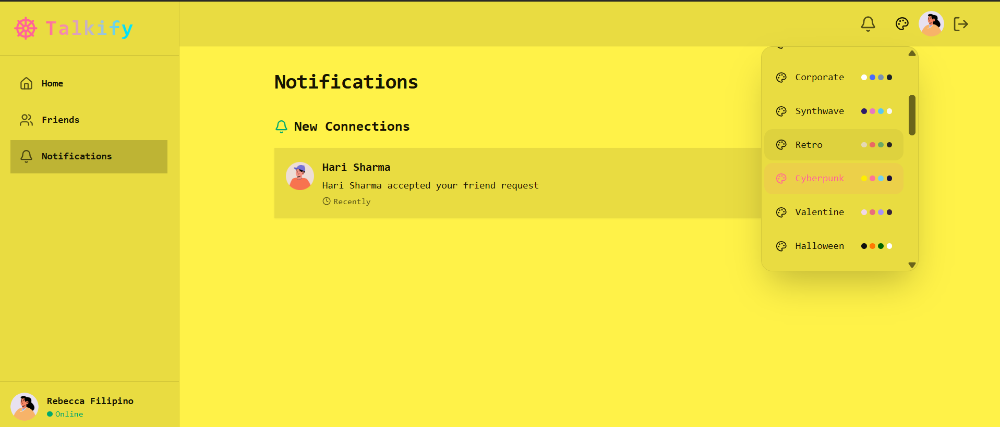

-----
# Talkify

Talkify is a real-time video calling and chat application designed to connect language learners worldwide. Built with the MERN stack (MongoDB, Express.js, React, Node.js), Tailwind CSS, and DaisyUI, Talkify offers a seamless and customizable user experience with 32 different themes to choose from. It leverages JSON Web Tokens (JWT) for secure user authentication and **GetStream.io** for real-time chat and video communication. For efficient data fetching and state management on the client side, Talkify also utilizes **TanStack Query**.

## Features

  * **User Authentication:** Secure sign-up and sign-in with JWT.
  * **Real-time Chat:** Instant messaging with individual friends powered by **GetStream.io**.with   typing indicators,emoji reactions and images and file sharing(images,docs).
  * **Video Calling:** One-on-one video calls for immersive language practice, also powered by **GetStream.io**.
  * **Efficient Data Fetching:** Optimized data fetching, caching, and synchronization on the frontend using **TanStack Query**.
  * **Friend Management:** Add, view, and manage your language exchange partners.
  * **Notifications:** Get notified about new friend connections.
  * **Profile Management:** Display native and learning languages.
  * **Theme Customization:** Personalize your experience with 32 unique themes powered by DaisyUI.
  * **Responsive Design:** Optimized for various screen sizes using Tailwind CSS.

## Technologies Used

**Frontend:**

  * React.js
  * Tailwind CSS
  * DaisyUI (for themes)
  * **TanStack Query**
  * **Stream Chat (Client SDK)**

**Backend:**

  * Node.js
  * Express.js
  * MongoDB (with Mongoose for ODM)
  * **Stream Chat (Server SDK)**
  * JWT (JSON Web Tokens)
  * Bcrypt.js (for password hashing)

## Getting Started

Follow these instructions to set up and run Talkify on your local machine.

### Prerequisites

  * Node.js (LTS version recommended)
  * npm (comes with Node.js) or Yarn
  * MongoDB Atlas account or a local MongoDB instance
  * **GetStream.io account** (for API Key and Secret for chat and video functionality)

### Installation

1.  **Clone the repository:**

    ```bash
    git clone <your-repository-url>
    cd talkify
    ```

2.  **Backend Setup:**

    Navigate to the `backend` directory (or your server directory if named differently):

    ```bash
    cd backend
    ```

    Install dependencies:

    ```bash
    npm install
    # or
    yarn install
    ```

    Create a `.env` file in the `backend` directory and add your environment variables:

    ```
    PORT=5000
    MONGO_URI=<Your MongoDB Connection String>
    JWT_SECRET_KEY=<A strong, random secret key>
    STREAM_API_KEY=<Your GetStream.io API Key>
    STREAM_API_SECRET=<Your GetStream.io API Secret>
    ```

      * `MONGO_URI`: Your MongoDB connection string (e.g., from MongoDB Atlas).
      * `JWT_SECRET_KEY`: A secret key for signing JWTs. You can generate one using `node -e "console.log(require('crypto').randomBytes(32).toString('hex'))"`.
      * `STREAM_API_KEY`: Your API Key obtained from your GetStream.io dashboard.
      * `STREAM_API_SECRET`: Your API Secret obtained from your GetStream.io dashboard.

    Start the backend server:

    ```bash
    npm start
    # or
    yarn start
    ```

    The backend server will run on `http://localhost:5000` (or your specified PORT).

3.  **Frontend Setup:**

    Open a new terminal and navigate to the `frontend` directory (or your client directory if named differently):

    ```bash
    cd ../frontend
    ```

    Install dependencies:

    ```bash
    npm install
    # or
    yarn install
    ```

    Create a `.env` file in the `frontend` directory and add your environment variables:

    ```
    REACT_APP_BACKEND_URL=http://localhost:5000
    REACT_APP_STREAM_API_KEY=<Your GetStream.io API Key (same as backend)>
    ```

      * `REACT_APP_BACKEND_URL`: The URL of your backend server.
      * `REACT_APP_STREAM_API_KEY`: Your API Key obtained from your GetStream.io dashboard, which the frontend will use to initialize the Stream Chat client.

    Start the frontend development server:

    ```bash
    npm start
    # or
    yarn start
    ```

    The frontend application will open in your browser at `http://localhost:3000`.

## Screenshots

Here are some screenshots of Talkify in action:

**Login Page:** 

**Create Account Page:** 

**Friends Page (Light Theme):**

**Friends Page (Dark Theme):**

**Friends Page2 (Light Theme):** 

**Friends Page2 (Dark Theme):** 

**Theme Selection (Retro Theme):**

**Notifications Page:**
     

**Chat Interface:**

**Video Call:**

**Video Call Options:**

## Usage

1.  **Sign Up/Login:** Create a new account or log in with existing credentials.
2.  **Explore Friends:** View your current friends and their native/learning languages.
3.  **Meet New Learners:** The "Meet New Learners" section will suggest potential language exchange partners (currently "No recommendations available" as per the screenshot, implying future implementation or an empty database).
4.  **Send Friend Requests:** (Not explicitly shown but implied by the "Friend Requests" button and notification system) Connect with new users.
5.  **Chat:** Click on a friend's profile to open a chat window and send messages in real-time.
6.  **Video Call:** Initiate a video call directly from the chat interface to practice speaking.
7.  **Customize Theme:** Change the application's theme from the top-right corner to suit your preference.


## Contact

For any questions or inquiries, please contact [Drishti Porwal/drishtiporwal345@gmail.com].